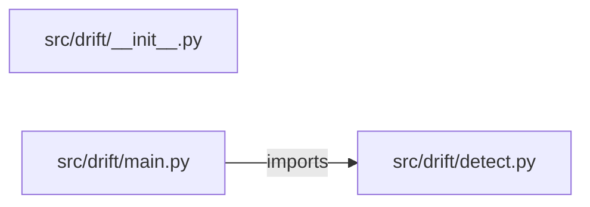

# model-drift-detection — project architecture

[README](README.md) · [Interview questions and answers](INTERVIEW_QA.md)

## Purpose and scope

Compare a current batch with a reference batch. Drift is true when the mean moves by at least two reference standard deviations. The check does not retrain a model.

This document describes files and symbols in this checkout. Deployment templates and statements in the original overview are distinguished from a verified running environment.

## Component diagram



For Python repositories, arrows show resolved local imports, not network calls or deployment order. Otherwise the diagram is a repository component map; containment arrows do not assert runtime integration.

## Components and responsibilities

| Component | Responsibility |
| --- | --- |
| [`src/drift/main.py`](src/drift/main.py) | HTTP handlers: `POST /drift` |
| [`src/drift/detect.py`](src/drift/detect.py) | Functions: `_mean`, `_std`, `detect` |
| [`requirements.txt`](requirements.txt) | Implementation or supporting configuration |
| [`src/drift/__init__.py`](src/drift/__init__.py) | Implementation or supporting configuration |
| [`tests/test_drift.py`](tests/test_drift.py) | Executable checks and regression examples |
| [`.github/workflows/ci.yml`](.github/workflows/ci.yml) | GitHub Actions job definitions |
| [`README.md`](README.md) | Project explanations or operating notes |

## Request interface

| Method and path | Handler | Source |
| --- | --- | --- |
| `POST /drift` | `post_drift` | [`src/drift/main.py`](src/drift/main.py#L7) |

The table lists literal route decorators found in the inspected Python modules. Router prefixes and middleware can add behavior; check the linked handler and application setup before calling an endpoint.

## Implementation walkthrough

### `detect(reference, current)`

Source: [`src/drift/detect.py`](src/drift/detect.py#L9).

Calls visible in this function: `_mean`, `_std`, `abs`, `round`.

```python
def detect(reference, current):
    shift = abs(_mean(current) - _mean(reference)) / _std(reference)
    return {"mean_shift": round(shift, 4), "drift": shift >= 2, "retrained": False}
```

## Data flow and design decisions

### What is the input-to-output contract of `detect`

In [`src/drift/detect.py`](src/drift/detect.py#L9), `detect(reference, current)` receives the inputs. The function computes these intermediate values:

- `shift = abs(_mean(current) - _mean(reference)) / _std(reference)`

Its result is defined by:

- `{'mean_shift': round(shift, 4), 'drift': shift >= 2, 'retrained': False}`

## Setup and verification

The following commands are derived from the checked-in dependency/test contracts. Execute them from the repository root; the block prepares a local environment, not a cloud deployment.

```bash
python3 -m venv .venv
source .venv/bin/activate
python -m pip install -r requirements.txt
python -m pytest -q
```

Python dependencies: [`requirements.txt`](requirements.txt).

Test entry points: [`tests/test_drift.py`](tests/test_drift.py).

Automation definitions: [`.github/workflows/ci.yml`](.github/workflows/ci.yml). Read their triggers and job steps to determine what CI actually runs.

## Operating boundaries and design review

Before turning this checkout into a customer deployment, establish the input contract, data ownership, access controls, failure response, evaluation criteria, and rollback owner. Repository fixtures and unit tests demonstrate local behavior; they do not establish throughput, uptime, compliance, or business impact.

A useful architecture review starts with the linked implementation: identify where input enters, where a decision is made, which state can change, and which external dependency can fail. Add a deployment view only for infrastructure that is actually configured and exercised.
